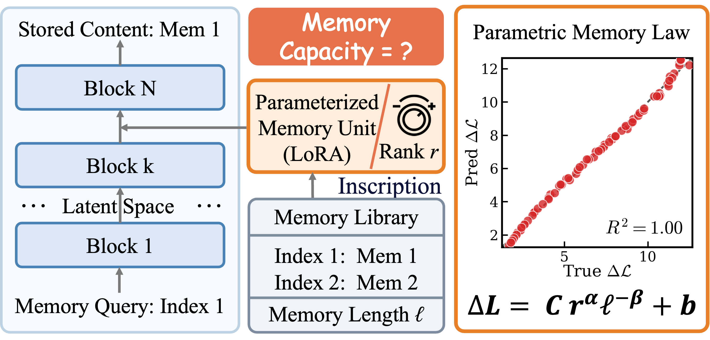
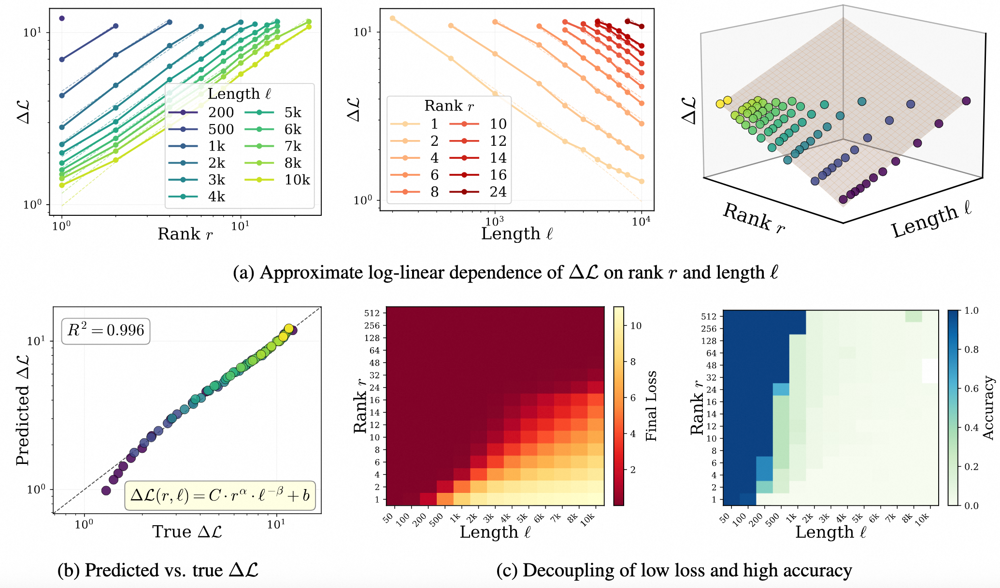

# How LoRA Remembers? A Parametric Memory Law for LLM Finetuning

<p align="center">
  <a href="https://arxiv.org/abs/2605.30260">
    
  </a>
  <a href="https://github.com/zjunlp/ParametricMemoryLaw/blob/main/LICENSE">
    
  </a>
  
</p>

> **In one sentence:** This paper uses LoRA as a controllable capacity probe to quantify *exact* parametric memory in LLMs, uncovering a power-law **Parametric Memory Law**, a **deterministic phase transition** at token probability `p = 0.5`, and a threshold-guided fine-tuning method **MemFT** that beats standard SFT in both fidelity and parameter efficiency.


<p align="center">
  
</p>

## Overview

LLMs store knowledge in frozen parameters, yet the real world keeps changing. Writing new information *exactly* into model weights under a strict parameter budget is an open problem. We treat LoRA as a memory probe in the latent space and make three layered contributions:

- **Parametric Memory Law.** A robust power law `ΔL = C · r^α · ℓ^(-β) + b` links the loss reduction `ΔL` to LoRA rank `r` (capacity) and sequence length `ℓ`, holding across models, datasets, and semantic densities (R² > 0.98).
- **Deterministic Phase Transition.** Average loss hides token-level competition: a few *stubborn tokens* trigger cascading decoding collapse. Under greedy decoding, target probability `p > 0.5` (i.e. loss < `ln 2 ≈ 0.693`) is a *sufficient* condition for verbatim recall, giving a clean ordered/disordered phase boundary.
- **MemFT.** A memory-oriented fine-tuning method that redistributes the gradient budget from already-memorized tokens to sub-threshold ones. Two variants — `MemFT-OT` (threshold-only) and `MemFT-SW` (sliding-window / curriculum) — outperform standard LoRA SFT and even improve generalization.

This repository provides the code for the two benchmarks and three methods used in the paper.

<p align="center">
  
</p>

## Benchmarks

- PhoneBook: a multi-sample short key-value exact memorization task.
- Long-Context: a single long-sequence memorization task with random ratios `r0`, `r20`, `r40`, `r60`, `r80`, and `r100`.

Entrypoints:

- PhoneBook: `script/pb/`
- Long-Context: `script/long_context/`

Both benchmarks support `qwen3-8b` and `llama3.1-8b`. The default layers are Qwen layer 24 and Llama layer 18.

## Methods

- `sft`: standard LoRA SFT baseline.
- `memft_ot`: only-threshold MemFT.
- `memft_sw`: sliding-window / curriculum MemFT.

Note: PhoneBook and Long-Context use different `memft_sw` mechanisms. PhoneBook uses Inter-Batch Temporal Curriculum with length-dependent hyperparameters. Long-Context uses Intra-sample Spatial Sliding.

## Quick Start

PhoneBook training:

```bash
METHOD=sft bash script/pb/run_pb_train_qwen.sh
METHOD=memft_ot bash script/pb/run_pb_train_qwen.sh
METHOD=memft_sw bash script/pb/run_pb_train_qwen.sh
```

PhoneBook apply and final loss:

```bash
METHOD=sft bash script/pb/run_pb_apply_qwen.sh
METHOD=sft bash script/pb/run_pb_final_loss_qwen.sh
```

Long-Context training:

```bash
METHOD=sft bash script/long_context/run_long_context_train_qwen.sh
METHOD=memft_ot bash script/long_context/run_long_context_train_qwen.sh
METHOD=memft_sw bash script/long_context/run_long_context_train_qwen.sh
```

Long-Context apply and final loss:

```bash
METHOD=sft bash script/long_context/run_long_context_apply_qwen.sh
METHOD=sft bash script/long_context/run_long_context_final_loss_qwen.sh
```

Use the Llama wrappers by replacing `_qwen.sh` with `_llama.sh`.

Common overrides:

```bash
METHOD=memft_sw LENGTHS="1000 2000" RANKS="4 8" GPU_ID=0 bash script/pb/run_pb_train_qwen.sh
METHOD=sft RATIOS="r0 r20 r40" LENGTHS="50 100 200" RANKS="1 2 4" bash script/long_context/run_long_context_train_qwen.sh
```

## Outputs

PhoneBook:

```text
vectors/pb/<method>/<model>/random/length_<L>/layer_<layer>/rank_<R>/
generation/pb/<method>/<model>/random/length_<L>/layer_<layer>/rank_<R>/
generation/pb/<method>/<model>/random/length_<L>/layer_<layer>/rank_<R>/final_loss/
```

Long-Context:

```text
vectors/long_context/<method>/<model>/<ratio>/length_<L>/layer_<layer>/rank_<R>/
generation/long_context/<method>/<model>/<ratio>/length_<L>/layer_<layer>/rank_<R>/
generation/long_context/<method>/<model>/<ratio>/length_<L>/layer_<layer>/rank_<R>/final_loss/
```

See `docs/phonebook_benchmark.md` and `docs/long_context_benchmark.md` for full sweep details.
